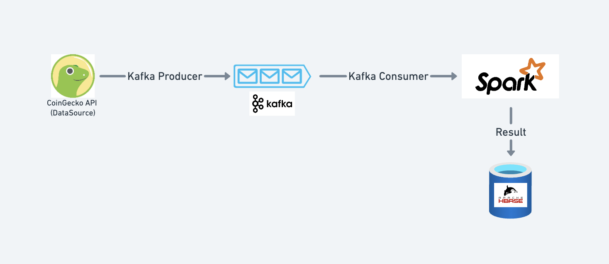
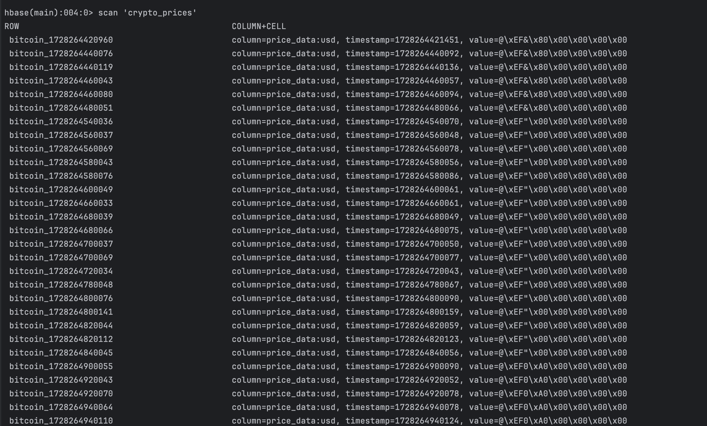

# Big Data Tools: Cryptocurrency Price Streaming

## Project Overview

This project demonstrates a distributed data processing system built using Apache Kafka and Apache Spark, designed to stream cryptocurrency price data. It integrates with [CoinGecko](https://www.coingecko.com/) to retrieve live cryptocurrency data, streams the data using Kafka, and processes it using Spark. The project is broken into two main components: a Kafka consumer for streaming crypto prices and a Spark application for data processing and analysis.

### Key Components:
1. **Kafka Producer**: Fetches live cryptocurrency data from the CoinGecko API and streams it to a Kafka topic.
2. **Kafka Consumer (Spark)**: Consumes the streamed data from the Kafka topic and processes it using Apache Spark.
3. **HBase**: For storing processed data from Spark for further analysis.

---

## Project Structure

```
bdt-project-main/
│
├── crypto_price_kafka_consumer/    # Kafka producer and consumer
│   ├── src/main/java/com/bdt/assignment/bdt_final_project/
│   │   ├── BdtFinalProjectApplication.java   # Main Spring Boot application
│   │   ├── config/CoinGeckoProperties.java   # Configuration for CoinGecko API
│   │   ├── data/CoinData.java                # Data model for coin information
│   │   ├── data/CryptoData.java              # Data model for crypto price data
│   │   ├── producer/KafkaProducer.java       # Kafka Producer implementation
│   │   └── service/CryptoStreamingService.java # Service to fetch and stream data
│   └── src/main/resources/application.yml    # Configuration file (Kafka, CoinGecko)
│
├── spark/                      # Spark application for consuming and processing data
│   ├── src/main/java/com/bdt/assignment/
│   │   ├── App.java            # Main Spark application
│   │   ├── data/CoinData.java   # Data model for coin information
│   │   ├── data/CryptoData.java # Data model for crypto price data
│   │   ├── service/HBaseService.java          # Service to interact with HBase
│   │   └── service/SparkKafkaConsumerService.java # Kafka consumer implementation for Spark
│   └── src/test/java/com/bdt/assignment/      # Test files
├── .gitignore                   # Git ignore rules
└── README.md                    # This README file
```
---



---

## Prerequisites

Before running this project, ensure you have the following installed on your system:

1. **Java 8 or above** (for both Spring Boot and Spark)
2. **Apache Kafka** (for messaging)
3. **Apache HBase** (for data storage)
4. **Maven** (for managing dependencies)
5. **Apache Spark** (for distributed data processing)
6. **CoinGecko API** account (for fetching live crypto prices). Some default values are provided in the `application.yml` file.

---

## Setting Up the Project

### Step 1: Clone the Repository
Clone this repository to your local machine using the following command:

```bash
git clone https://github.com/unilpha/bdt-project.git
```

### Step 2: Install Dependencies

Navigate to the project directory and run Maven to install the required dependencies for both modules:

```bash
# Kafka Consumer Module
cd crypto_price_kafka_consumer
mvn clean install

# Spark Module
cd ../spark
mvn clean install
```

### Step 3: Configure the Application

Edit the `application.yml` file located in `crypto_price_kafka_consumer/src/main/resources/` to configure the following properties:

- **CoinGecko API**:
    - Set your CoinGecko API URL and other relevant parameters.

- **Kafka**:
    - Configure Kafka broker URLs and the topic name for streaming crypto prices.

```yaml
spring:
  kafka:
    bootstrap-servers: 
    
coin-gecko:
  url: 
  auth-key: 
  auth-header: 
```

### Step 4: Running the Kafka Consumer

To run the Spring Boot application that streams cryptocurrency data:

```bash
cd crypto_price_kafka_consumer
mvn spring-boot:run
```

This will start the service, fetch real-time data from CoinGecko, and publish the data to a Kafka topic.

---

## Spark Application

The Spark application is responsible for consuming the crypto data from the Kafka topic and processing it. The processed data is then stored in HBase for further analysis.

### Step 1: Running the Spark Consumer

Use the following command to run the Spark job:

```bash
cd spark
mvn exec:java -Dexec.mainClass="com.bdt.assignment.App"
```

### Step 2: Setup HBase Table

In the Hbase Shell, create a table called `crypto_prices` with the following schema:

```bash
hbase> create 'crypto_prices', 'price_data'
```

### Step 3: HBase Integration

The Spark consumer processes the data and stores it into HBase using the `HBaseService.java`. Ensure HBase is running and properly configured.

---

## **Sample Data and Output**

### **CoinGecko API Response:**

```json
{
    "bitcoin": {
        "usd": 63449
    },
    "ethereum": {
        "usd": 2458.8
    }
}
```

### **Kafka Producer Sample Output:**

The following is an example of a JSON message sent to the Kafka `crypto_prices` topic:

```json
{
    "timestamp": "2024-10-07T11:49:22",
    "bitcoin": {
        "usd": 63449
    },
    "ethereum": {
        "usd": 2458.8
    }
}
```

### **Kafka Consumer and Spark Streaming Processing:**

Once consumed by the Spark Streaming application, the data is processed and structured for storage in HBase.

### **HBase Storage Format:**

After processing the data, the results are stored in HBase with the following structure:

| RowKey               | Timestamp           | Bitcoin Price | Ethereum Price |
|----------------------|---------------------|---------------|----------------|
| 2024-10-07T11:49:22  | 2024-10-07 11:49:22 | $63,449       | $2,458.8       |

#### **Querying HBase:**

You can query the HBase table to retrieve cryptocurrency prices:

```bash
hbase> scan 'crypto_prices'
```

Example Output:



---

## Technologies Used

- **Java 8+**: Programming language.
- **Spring Boot**: Framework for building the Kafka consumer and API interactions.
- **Apache Kafka**: Messaging system to stream crypto price data.
- **Apache Spark**: Distributed data processing framework for analyzing the streamed data.
- **Apache HBase**: NoSQL database to store processed data.
- **Maven**: Dependency management and build tool.

---


## Acknowledgments

- [CoinGecko API](https://www.coingecko.com/) for providing cryptocurrency data.
- [Apache Kafka](https://kafka.apache.org/) and [Apache Spark](https://spark.apache.org/) for powerful data streaming and processing capabilities.

---